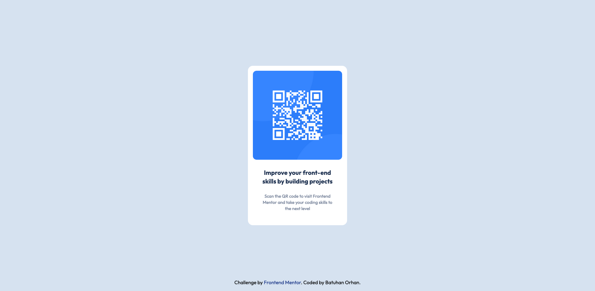

# Frontend Mentor - QR code component solution

This is a solution to the [QR code component challenge on Frontend Mentor](https://www.frontendmentor.io/challenges/qr-code-component-iux_sIO_H). Frontend Mentor challenges help you improve your coding skills by building realistic projects.

## Table of contents

- [Frontend Mentor - QR code component solution](#frontend-mentor---qr-code-component-solution)
	- [Table of contents](#table-of-contents)
	- [Overview](#overview)
		- [Screenshot](#screenshot)
		- [Links](#links)
		- [Built with](#built-with)
	- [Author](#author)

## Overview

### Screenshot

### Links

- Solution URL: [Github](https://github.com/bthnorhan/fm-qr-code-component)
- Live Site URL: [Github Pages](https://bthnorhan.github.io/fm-qr-code-component/)

### Built with

- Semantic HTML5 markup
- CSS
- Flexbox
- [Tailwind](https://tailwindcss.com/) - For styles

## Author

- Website - [Batuhan Orhan](https://batuhanorhan.com/)
- Frontend Mentor - [@bthnorhan](https://www.frontendmentor.io/profile/bthnorhan)
